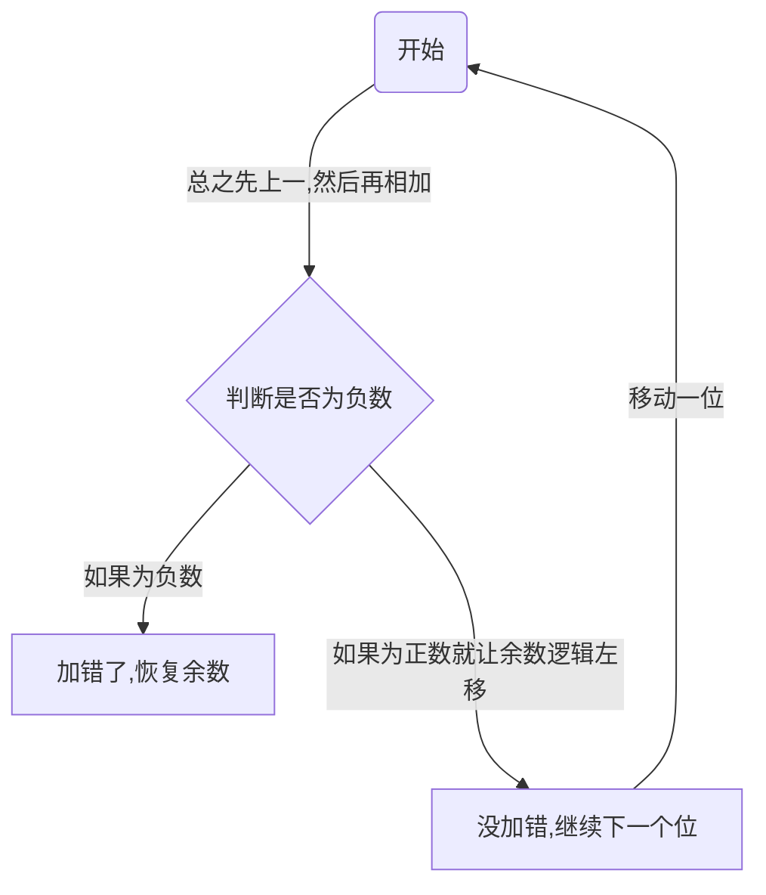

# 原码的除法运算

## 手算除法

> 十进制的手算除法

$$
\begin{align*}
&x(除数) \div y(被除数) =a ……b \rightarrow x(除数) = a \times y + b\\
&可知我们的除数=被除数*结果 + 余数
\end{align*}
$$

> 二进制的手算除法

因为我们的机器字长是5位，所以我们在得到了5个位商就可以停止

## 计算机算除法

### 恢复余数法

> 设机器字长为5位(含1位符号位，n=4) ，x=0:1011, y=0.1101, 采用原码恢复余数法求x/y
> $|x|=0.1011，|y|=0.1101， [|y|]_补=0.1101, [-|y|]_补=1.0011$
>
> 符号位单独处理:$符号位=x_5 \bigoplus y_5$数值位取绝对值进行除法计算

如上图,我们的**被除数会被存储在ACC中,而除数会被存储在x中**,其中MQ的灰色的一位就是当前正在确定的计算位

计算机很傻，会先默认上商1，如果搞错了再改上商0。并“恢复余数'
如果我们默认上商1,那么我们现在就判断$被除数-除数$是否大于0,但是我们计算机可以直接加负除数的补码，这样就省去了减法操作

此时我们可以看到，当我们上1的时候(本来应该上0),我们使用被除数-除数等于
$$
\underline{(ACC)}+\underline{[-|y|]_补} &\rightarrow \underline{ACC}\\
01011+10011 &= 11110
$$
可以看到最终我们相减的结果符号位是1，说明这是一个负数，实际上这个位应该上0,**这个时候我们就需要恢复余数**，然后给ACC正确的值

现在我们已经有一个正确的值了，接下来我们让ACC，MQ整体==逻辑左移==,ACC高位丢弃,MQ低位补0

然后我们再重复之前的操作，开始给商上1

可以看到，我们现在的得数正确，所以就不用管了，直接逻辑左移然后进入下一位直到最后一位

最后等我们算完了我们需要在最后得数的基础上再乘以2的-n次方(机器字长-符号位)

$$
余数 = 0.0111 \times 2^{-n}(n的值为机器字长-1_{减去符号位})
$$
最后我们再单独处理符号位
$$
x=0.1011\\
y=0.1101\\
符号位=x_5\bigoplus y_5
$$
 

> 加减交替法(不回复余数法)

加减交替法就是在余数恢复法中，如果商为负数就直接逻辑左移

