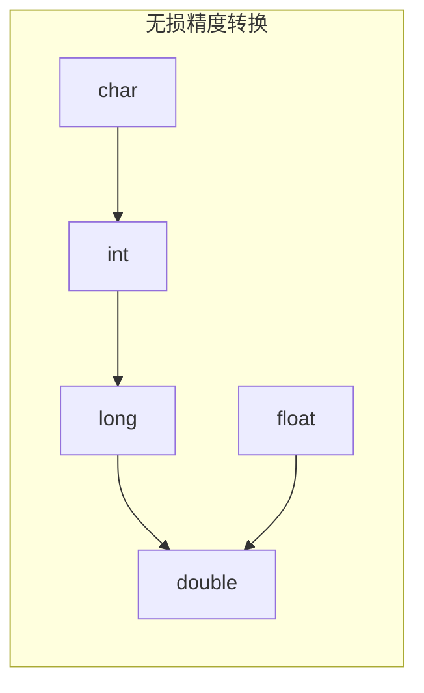

# 浮点数的运算

浮点数加减法运算步骤:

1. 对阶
2. 位数加减
3. 规格化
4. 舍入
5. 判断是否溢出

## 从十进制了解浮点数的加减法运算

$$
9.85211 \times 10^{12} + 9.96007 \times 10^{10}
$$

1. 对阶，
	- 我们需要对阶，==在计算机中我们统一让阶数小的向阶数大的数字靠齐,因为方便计算机运算==

$$
9.85211 \times 10^{12} + 0.0996007 \times 10^{12}
$$

2. 尾数相加减
	- 可以看到我们现在的阶数都是12，现在可以进行运算了,让我们的**尾数部分相加减**

$$
9.9517107 \times 10^{12}
$$

3. 规格化
	- 如果尾数加减出现类似$0.0099517 \times 10^{12}$时，需要“左规”让我们的数字变成$9.9517 \times 10^{9}$;
   - 如果尾数加减出现类似$99.517107 X 10^{12}$时，需要“右规”,让数字变成$9.9517107 \times 10^{13}$

4. 舍入
	- 若规定只能保留6位有效尾数，则$9.9517107 \times 10^{12} \rightarrow 9.95171 \times 10^{12}$(多余的直接砍掉)
   - $9.9517107 \times 10^{12} \rightarrow 9.95172 \times 10^{12}$ (若 砍掉部分非0，则入1)
   - 也可以采用四舍五入的原则，当舍弃位≥5时，高位入1

5. 判断是否溢出
   - 若规定阶码不能超过两位，则运算后阶码超出范围，则溢出
     如: $9.85211 \times 10^{99} + 9.96007 \times 10^{99}= 19.81218 \times 10^{99}$
     规格化并用四舍五入的原则保留6位尾数，得$1.98122 \times 10^{100}$
   - ==阶码超过两位，发生溢出==(注:尾数溢出未必导致整体溢出，也许可以通过③④两步来拯救)

## 浮点数的加减运算

### 关于舍入

- “0”舍“1”入法:类似于十进制数运算中的“四舍五入”法，**即在尾**
  **数右移时，被移去的最高数值位为0，则舍去; 被移去的最高数值位为1,**
  **则在尾数的末位加1**。这样做可能会使尾数又溢出，此时需再做一次右规。
- 恒置“1”法:**尾数右移时，不论丢掉的最高数值位是“1”还是“0”,**
  **都使右移后的尾数末位恒置“1”**。这种方法同样有使尾数变大和变小的两
  种可能。

## 强制类型转换

如果是大转小，就会直接截断

## 回顾

